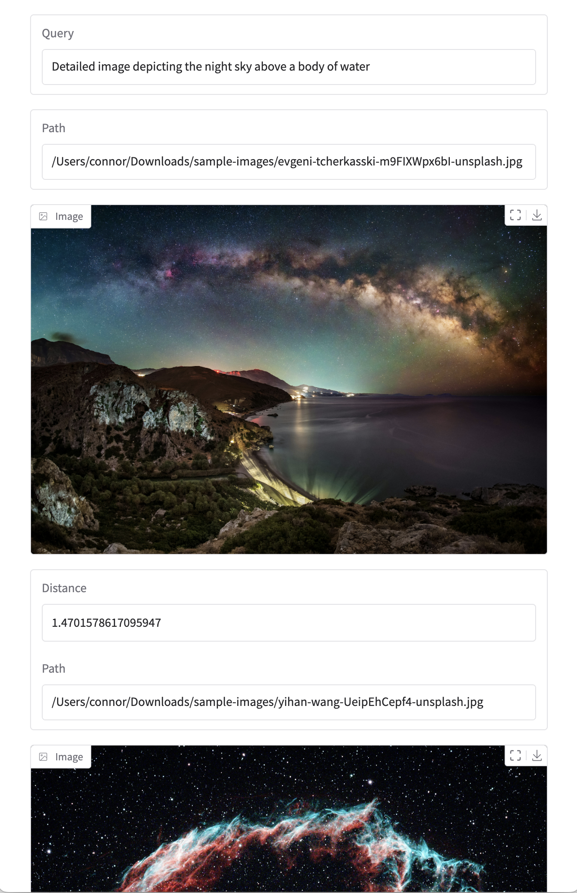

# Semantic Image Search

Search local images using natural language queries.

Under the hood, this project uses [Chroma](https://www.trychroma.com/) and its [OpenCLIP](https://github.com/mlfoundations/open_clip) integration to index a directory of images. The images can then be searched using a [Gradio](https://www.gradio.app/)-powered interface which updates in real-time as you type.

## Usage

Since this project is a command-line application, it's recommended that you use [`pipx`](https://github.com/pypa/pipx) to install it in an isolated environment:

```bash
pipx install git+https://github.com/connorbrinton/image-search.git
```

After installation, you can run the application with the following command:

```bash
image-search <path-to-image-directory>
```

Once the images in the given directory have been indexed using OpenCLIP, a search interface will be opened in your default web browser. You can then type in natural language queries to search the images.



## Metal Performance Shader (MPS) Devices

Chroma's usage of OpenCLIP currently does not support Metal Performance Shader (MPS) devices. As a result, you may encounter an error like the following on MPS devices:

```
RuntimeError: slow_conv2d_forward_mps: input(device='cpu') and weight(device=mps:0')  must be on the same device in add.
```

This error is fixed by [this change to Chroma](https://github.com/chroma-core/chroma/pull/3295), but it has not yet been merged. In the meantime, you can manually edit the `open_clip_embedding_function.py` from Chroma with [these changes](https://github.com/connorbrinton/chroma/commit/7e7817a7b493760ba5f57040b5bca985f5b85e14).
